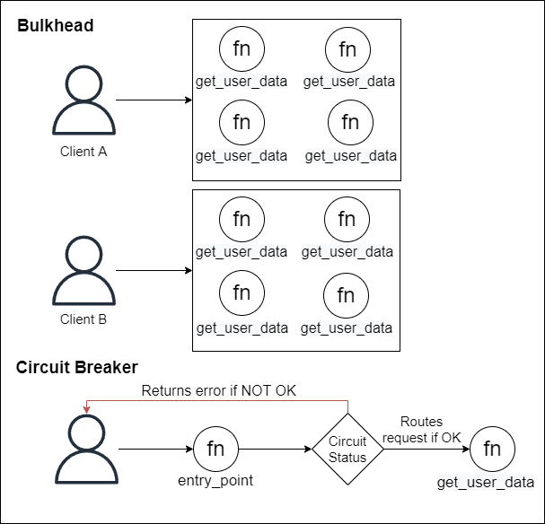

# Bulkhead as alternative to Circuit-Breaker:
These two patterns propose solutions to the problem of having a component that is a single point of failure in a system. Bulkhead does this with a replication approach, having multiple instances of the component in separate pools. Circuit-breaker uses another way to deal with that: isolating the broken component while it recovers, without replication.

### Use case
 Say you're building an e-commerce back-end service that fetches and returns offers from a database. To do so, it provides endpoints to serverless functions to clients to retrieve this data. Since this component can be a single point of failure for this e-commerce website, you wish it to be as much available as possible. You could choose to provide these functions using the Bulkhead pattern, meaning that you would provide different pools of functions to different clients, replicating them in different and isolated pools, so that a failed pool would not impact all the clients. On the other hand, you could implement a Circuit Breaker using a state-machine manager (e.g., AWS Step Functions, Azure Functions), so that you could prevent failing functions to be called when it's recovering from a catastrophic event. Both solutions would fit for the purpose, and could be implemented together to achieve best results.

 

 ### Trade-off Analysis
Bulkhead is a simpler solution to implement but leads to an increased cost, since it provides replicated functions to offer availability. Circuit-Breaker, by the other side, provides a non-trivial solution, but the cost will be only an extra function that will manage the state of the circuit. 