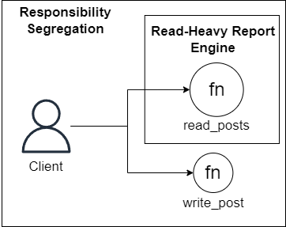

# Read-heavy Report Engine as motivation to Responsibility Segregation
Read-heavy Report Engine depends on Responsibility Segregation in its essence. The first one needs the read operations to be fully separated of write operations, so that it can scale each one properly to provide a powerful read engine for heavy workloads. 

### Use case
Imagine you're building a social network back-end service that deals with storing and providing the posts of the feed to a user. To do so, you created serverless functions that will read and write the data to a database. By following the Pareto's principle, you could implement the Read-heavy Report Engine pattern and properly scale each of the functions to execute each type of task, for example, giving more resources to read functions to write functions. To do so, you need that this logic to be precisely separated, as proposed by Responsibility Segregation pattern, by having separated functions for read and write operations. 

