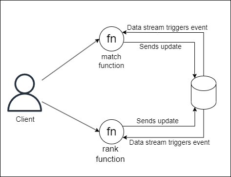

# Externalized State as motivation to Data Streaming
Using Data Streaming is a powerful way to keep the state of Lambdas up to date in order to guarantee no inconsistent states. 

### Use case 
Say you're building a game in which the user score needs to be shared by both, the game match and the global rank, and you have each of these components separated in two services. You probably want that the global to be updated with the current score of the game, so you can use Data Streaming services (e.g., AWS Kinesis) to have an Externalized State of the game match execution.

