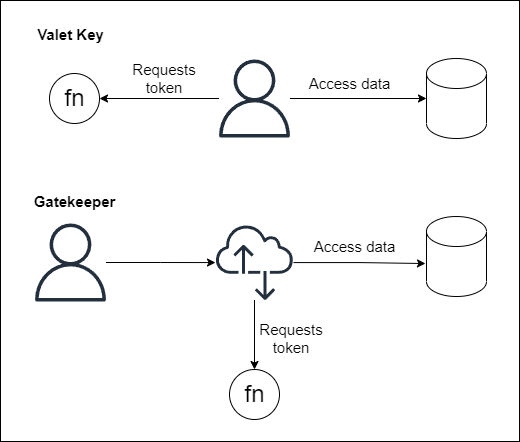

# Gatekeeper as alternative to Valet Key
Both patterns are similar and solves the same problem: dealing with authorization to securely call a restricted service. Gatekeeper does this by abstracting the credentials gathering from the client, leaving it to be a responsibility of the API Gateway. Valet Key lets to the client the responsibility of getting the authorization headers from an authorizer function and attach them to the requests. 

### Use case
Suppose you own a database of user data and need to expose it to other teams of your company securely. You can do this using a serverless approach using the Gatekeepr pattern, that simply exposes the database through an API Gateway and this gateway would be responsible for getting the authorization token by calling an authorizer function. Another way to do that would be to directly expose this function and let your clients be responsbile for calling it and getting the authorization token, removing the extra layer and getting some latency and cost decrease by adding some more responsibility to the client.

### Trade-off Analysis
Calling an additional function adds one extra layer of complexity and cost, but gives more control and flexibility to the system.