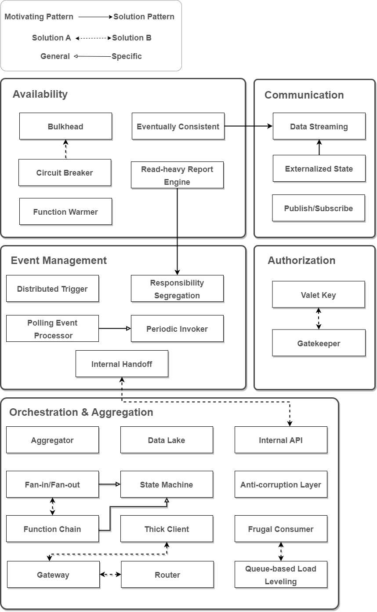

# Introduction
Below we list the patterns we used to built our pattern language, with a brief description containing its **context**, **problem** and **solution**. After that, we present the diagram and the relationships of our language, together with use cases to exemplify each one.:

# Quick navigate
- [Patterns](#patterns)
    - [Read-heavy Report Engine](#)
    - [Bulkhead](#bulkhead)
    - [Circuit-Breaker](#)
    - [Function Warmer](#)
    - [Eventually Consisted](#)
    - [Aggregator](#)
    - [Fan-in/Fan-out](#)
    - [Function Chain](#)
    - [State Machine](#)
    - [Data Lake](#)
    - [API Gateway](#)
    - [Internal API](#)
    - [Router](#)
    - [Anti-corruption Layer](#)
    - [Frugal Consumer](#)
    - [Queue-based Load Leveling](#)
    - [Thick Client](#)
    - [Priority Queue](#)
    - [Externalized State](#)
    - [Data Streaming](#)
    - [Publish/Subscribe](#)
    - [Responsibility Segregation](#)
    - [Distributed Trigger](#)
    - [Internal Handoff](#)
    - [Periodic Invoker](#)
    - [Polling Event Processor](#)
    - [Gatekeeper](#)
    - [Valet Key](#)
- [Pattern Language](#pattern-language)

# Patterns
A brief description of the used patterns. To see it in details, read [Taibi et. al.](https://www.researchgate.net/publication/340121613_Patterns_for_Serverless_Functions_Function-as-a-Service_A_Multivocal_Literature_Review).

### Read-heavy Report Engine
- **Context**: Read-intensive applications
- **Problem**: Improve performance in read operations
- **Solution**: Usage of data caches and specialized views for most frequently queried data.

### Bulkhead
- **Context**: Functions with high TPS. 
- **Problem**: If a function fails, the whole system can be compromised.
- **Solution**: Partition functions in multiple pools, separating each pool for a set of clients. If a single pool becomes down, just a subset of the clients will be compromised.

### Circuit-Breaker
- **Context**: Downstream services being a point of failure. 
- **Problem**: If a downstream service is down, sending requests to it will cost resources and cause more impact.
- **Solution**: Create a “circuit” where whenever a high amount of failures is detected, the circuit opens and the requests are not sent to downstream services. When they are recovered, the circuit closes again and the requests are sent normally.

### Function Warmer
- **Context**: Latency-sensitive applications with low TPS.
- **Problem**: Functions have “cold-starts”, meaning that a function that is not used frequently will have a startup time when a request arrives.
- **Solution**: Have a cron job that calls the function periodically to keep it always warm.

### Eventually Consisted
- **Context**: Applications that need data replicated over - multiple **Problem**vices.
- **Problem**: Keep incoming data consistent over multiple services.
- **Solution**: Use stream services to trigger events made on the database to publish it to the multiple bases.

### Aggregator
- **Context**: Services that need to perform many operations or - **Problem**rom multiple sources.
- **Problem**: Overcome complexity of calling multiple services and aggregating the responses.
- **Solution**: Create a single function that calls the downstream services, aggregates the data and exposes it through an API.

### Fan-in/Fan-out
- **Context**: Execution of long tasks.
- **Problem**: Functions usually have a timeout if it keeps executing for a long time ($>$ 15 minutes). Long tasks would not finish and the connection with the caller will be closed without a response.
- **Solution**: Split the work into multiple parallel tasks, each part being executed by a function. At the end, the final result is aggregated.

### Function Chain
- **Context**: Execution of long tasks.
- **Problem**: Functions usually have a timeout if it keeps executing for a long time (~15 minutes). Long tasks would not finish and the connection with the caller will be closed without a response.
- **Solution**: Break the job into multiple sequential functions. 

### State Machine
- **Context**: Orchestration of multiple functions with state.
- **Problem**: Orchestrating a workflow of functions with different states is complex and can lead to unexpected results. 
- **Solution**: Use services such as AWS Step Functions to coordinate the execution of state machines.

### Data Lake
- **Context**: Persistence of large volumes of data.
- **Problem**: Storage of a large database with multiple transformations can be complex.
- **Solution**: Trigger functions for updating events in the database, process the raw data and persist it with the transformed data.

### API Gateway
- **Context**: Exposing access to back-end services.
- **Problem**: Exposing multiple endpoints to clients can be complex.
- **Solution**: Use an API Gateway to grant clients access to specific services.

### Internal API
- **Context**: Dealing with access to back-end services.
- **Problem**: Using an API Gateway would expose the services publicly, leading to possible security issues.
- **Solution**: Call internal functions directly using events.

### Router
- **Context**: Dealing with access to back-end services.
- **Problem**: Clients do not always know about downstream services and its endpoints.
- **Solution**: Use a “router function” that acts like a router, invoking services based on the payload content of the request.

### Anti-corruption Layer
- **Context**: Dealing with legacy systems.
- **Problem**: Sometimes, a service needs to call a legacy system that has old protocols or inconsistent behavior.
- **Solution**: Create a function that acts like a proxy, abstracting the calls to the legacy service.

### Frugal Consumer
- **Context**: Dealing with non-scalable services.
- **Problem**: Sometimes a non-scalable back-end service can be the bottleneck of the system.
- **Solution**: Use a queue that acts as a throttling queue that receives the requests from clients, and a function that processes the messages asynchronously and sends to the non-scalable service. With this function, it’s possible to limit the rate of requests that goes to the back-end.

### Queue-based Load Leveling
- **Context**: Dealing with non-scalable services.
- **Problem**: Use an entry-point function that receives the requests and posts them to a queue that acts as a throttling queue and sends to the non-scalable service. With this queue, it’s possible to limit the rate of message deliveries that goes to the back-end. 
- **Solution**: Create multiple queues with different priorities that triggers different functions, with resources allocated according to its prioritization. 

### Thick Client
- **Context**: Decrease of costs and latency.
- **Problem**: The Gateway pattern adds an intermediary layer to abstract downstream services, increasing costs and latency.
- **Solution**: Allowing clients to call services directly can reduce both.

### Priority Queue
- **Context**: Scale message processing with different priorities.
- **Problem**: Although serverless services handle scalability under the hood, sometimes it is necessary to control how messages are dealt by the system.
- **Solution**: Create multiple queues with different priorities that triggers different functions with resources allocated according to its prioritization

### Externalized State
- **Context**: Dealing with state in a serverless architecture.
- **Problem**: Functions are stateless, but sometimes state between them is necessary.
- **Solution**: To overcome this, an external database can be used to keep state across functions.

### Data Streaming
- **Context**: Applications that need to deal with continuous - **Problem**ta.
- **Problem**: Managing continuous incoming data can be complex, especially if it will b+ replicated through services.
- **Solution**: Use data streams, such as those offered by AWS DynamoDB, that can trigger events to functions whenever an update is made in a table.

### Publish/Subscribe
- **Context**: Dealing with notifications to internal services.
- **Problem**: Forward data for internal services.
- **Solution**: Use a publish/subscribe service, such as AWS SNS to propagate notifications from clients to backends.

### Responsibility Segregation
- **Context**: Scaling different operations accordingly to the - **Problem** requirements.
- **Problem**: Generally, reads and write operations occur with different frequencies. If a function performs both read and write operations, it could be difficult to scale it properly.
- **Solution**: Segregate the responsibility of reads and writes in different functions.

### Distributed Trigger
- **Context**: Broadcasting messages to multiple services.
- **Problem**: Notify multiple services with a new message.
- **Solution**: Create a single notification topic inside the notifier service and subscribe the downstream services to it.

### Internal Handoff
- **Context**: Calling functions asyncrhonously.
- **Problem**: Syncrhonous calls to functions will hold the connection open until a response is received from the function.
- **Solution**: Use "InvocationType" event, that sends an asyncrhonous message to functions and closes the connections. The message then can be processed and if it fails, can be sent to a dead-letter queue.

### Periodic Invoker
- **Context**: Dealing with periodic tasks.
- **Problem**: Execute tasks periodically.
- **Solution**: Configure a periodic event, such as offered by AWS EventBridge, that periodically calls a function.

### Polling Event Processor
- **Context**: Dealing with periodic tasks.
- **Problem**: Execute tasks periodically.
- **Solution**: Configure a periodic event, such as offered by AWS EventBridge, that periodically calls a function.

### Gatekeeper
- **Context**: Dealing with authorization to call services.
- **Problem**: Grant proper access to services.
- **Solution**: Use an API Gateway with an authorizer function that receives the authorization header and returns the correct authorization policy.

### Valet Key
- **Context**: Dealing with authorization to call services.
- **Problem**:Grant proper access to services.
- **Solution**: Here the client calls a function that returns the authorization headers to be included in the requests to the restricted service.

# Pattern Language
Below we show the diagram representing our language and list the relationships we propose in our pattern language:

### Alternatives to the same problem
- [Bulkhead as alternative to Circuit-Breaker](./I.md)
- [Read-heavy Report Engine as motivation to Responsibility Segregation](./II.md)
- [Eventually Consistent as motivation to Data Streaming](./III.md)
- [Externalized State as motivation to Data Streaming](./IV.md)
- [Thick Client as alternative to Gateway](./V.md)
- [Internal API as alternative to Internal Handoff](./VI.md)

### Patterns that motivation the usage of other patterns
- [Fan-in/Fan-out as alternative to Function Chain](./VII.md)
- [Fan-in/Fan-out and Function Chain as specification of State Machine](./VIII.md)
- [Gatekeeper as alternative to Valet Key](./IX.md)

### Generic/specific patterns
- [Frugal Consumer as alternative to Queue-based Load Leveling](./X.md)
- [#Polling Event Processor as specification of Periodic Invoker](./XI.md)