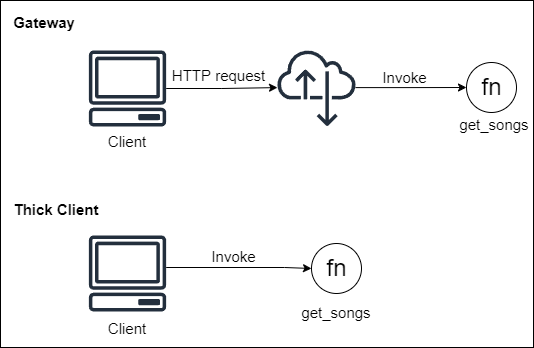

# Thick Client as alternative to Gateway
These two patterns solve the same problem: providing access to external clients to back-end services. Although, they are antagonists in the sense that Thick Client removes the abstraction that Gateway imposes with the top-layer functions that hides the endpoints of internal services.

### Use case
Imagine you're building an API to a web front-end music app. This API will have a serverless function that will fetch and return songs titles from a database. To access this API, the client can do this by calling an API Gateway endpoint or by directly invoking the function (Thick Client). In the first way, the clients will just need to know a single endpoint and the gateway will be responsible for routing the requests. In the second one, the clients will need to know how to properly invoke the function.

### Trade-off Analysis:
Thick Client provides both lower latency and costs than Gateway, since it removes all intermediary layers between the client and the services, with the cost of increasing the complexity in client's code and potential security issues.