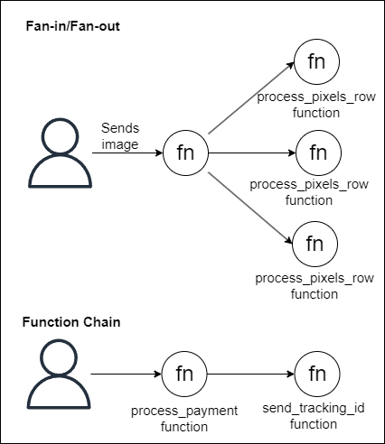

# Fan-in/Fan-out as alternative to Function Chain
Both patterns solves the problem of running long tasks in functions, but differ in the kind of problem they can be used to solve. 

### Use case 
Say you're building an image processing software that improves the quality of each pixel of an image. To do so, you could break this task by sending each row of pixels of the image to a different function, and then aggregate the final result in a final image. This is a case where Fan-in/Fan-out pattern is useful. However, there are some cases where breaking the tasks in parallel executions can be hard. Imagine now that you're building an e-commerce payment service and you have two functions to: 1) Performs the payment and 2) Send the tracking ID via email. Breaking this task into these two executions in parallel could be tough and problematic, since a failure in performing the payment would need to stop the execution of the second task before it finishes. In this case, a sequential execution, such as proposed by Function Chain would be much safer.

### Trade-off Analysis
Fan-in/Fan-out is a good pattern to deal with tasks that can be broke in parallel subtasks, such as multiple data searched. Function Chain works for subtasks that can't be executed in parallel, when the result of a function depends on the previous execution.