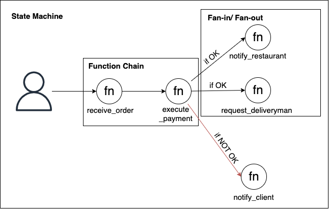

# Fan-in/Fan-out and Function Chain as specification of State Machine
The three patterns acts on solving the problem of orchestrating long tasks. The State Machine pattern can be implemented using at least one of them, with the complexity of dealing with the state of the application, as done by AWS Step Functions.

### Use case
Imagine you're building a food delivery app. The steps to order some food can be break in some sequential (Function Chain) and parallel (Fan-in/Fan-out) steps, using a state-machine to control the flow in the graph. For example, you could break the sequential steps in: 1) receiving the order and 2) executing the payment. If the payment is approved, you can break the execution in parallel steps like: 1) notifying the restaurant about the order and 2) requesting for a deliveryman to get the order in the restaurant. If the payment is denied, you can notify the client about the error. State-machine managers (such as AWS Step Functions) helps in the management of workflows, allowing to define how the data flows and how exceptions are treated during an execution.

