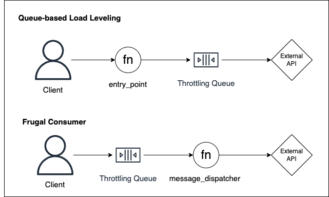

# Frugal Consumer as alternative to Queue-based Load Leveling
Both patterns are similar and solves the same problem: dealing with non-scalable back-ends. They differ in the way the client interacts with the throttling mechanism: the first one uses a function as entry point, while the second one uses the queue.

### Use case
Say you're building a front-end app that needs to call a non-scalable external API that throttles a high amount of transactions per second. You could work around this scalability problem by using either Frugal Consumer or Queue-based Load Leveling patterns. Both would work fine, with the difference that the last one is based on a message delivery request, while the first one is based on a direct function call. Both patterns would work in the same way, limiting the rate of messages delivered to the limiting service.

### Trade-off Analysis:
Calling a function adds one extra layer of complexity and cost, but makes it more general, making possible the extension to HTTP of event-based clients interactions. By the other side, removing this layer makes it specific to interactions using messages.