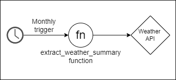

# Polling Event Processor as specification of Periodic Invoker 
The core logic of Polling Event Processor makes use of Periodic Invoker in order to check for updates in external systems. 

### Use case
Imagine you're building a service that needs to summarize the data about the weather of the last month. To do so, you extract this data from a public weather API. This task is executed monthly, and it provides no event-based API, so a solution such as Polling Event Processor is required. You can define a schedule (such as offered by AWS Event Bridge) to start a function execution once in a month, fetch and extract this data. 

